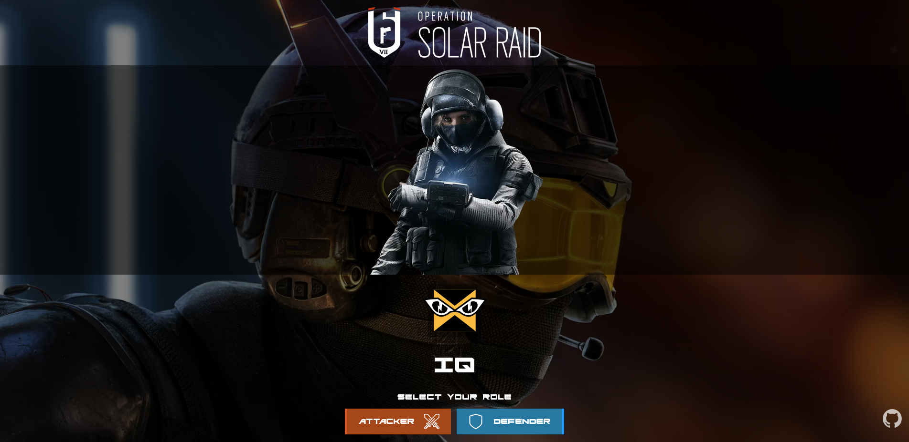

# R6S-Random-Picker

Project live at : https://achanty.github.io/R6S-Random-Picker/

This is a personnal project, about picking a random character to play depending of its role, in the videogame "Tom Clancy's Rainbow Six : Siege".

## Table of contents

-  [Overview](#overview)
   -  [Screenshot](#screenshot)
   -  [Links](#links)
-  [My process](#my-process)
   -  [Built with](#built-with)
   -  [Continued development](#continued-development)
-  [Author](#author)

## Overview

### Screenshot

### Links

-  Live Site URL: https://achanty.github.io/R6S-Random-Picker/

## My process

### Built with

-  Javascript
-  Semantic HTML5 markup
-  CSS custom properties
-  Sass preprocessor
-  Mobile-first workflow

### Continued development

This project will stay up to date, according to new characters coming out within the game.

## Author

-  Linkedin - [Anthony Chanty](https://www.linkedin.com/in/anthony-c-a925a6172/)
-  Frontend Mentor - [@achanty](https://www.frontendmentor.io/profile/AChanty)
